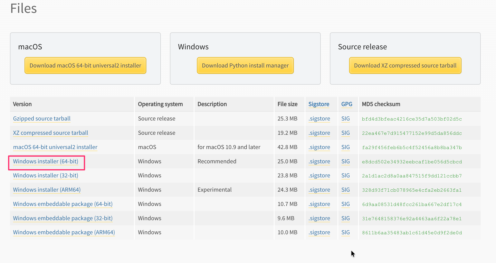

# mask-pii

日本語テキストの個人情報（氏名・住所・部門名）を自動でマスキングするツールです。
Excelファイルの問い合わせ内容をまとめて処理することができます。

> 📌 このREADMEは **Pythonを使ったことがない方** を対象に書いています。
> 上から順番に進めていけばそのまま動かせます。

---

## 目次

1. [このツールでできること](#1-このツールでできること)
2. [Pythonのインストール](#2-pythonのインストール)
3. [ライブラリのインストール](#3-ライブラリのインストール)
4. [ファイルの準備](#4-ファイルの準備)
5. [使い方](#5-使い方)
6. [出力結果の見方](#6-出力結果の見方)
7. [トラブルシューティング](#7-トラブルシューティング)

---

## 1. このツールでできること

顧客からの問い合わせテキストに含まれる個人情報を、AIを使わず**完全ローカル**でマスキングします。

**入力例:**
```
お世話になっております。A部門の佐藤です。
神奈川県横浜市に在住なのですが、NW速度が遅く、ご相談したいです。
```

**出力例:**
```
お世話になっております。[部門名]の[氏名]です。
[住所]に在住なのですが、NW速度が遅く、ご相談したいです。
```

**マスク対象:**

| 種別 | 例 |
|------|----|
| 氏名 | 佐藤、田中太郎 |
| 住所 | 神奈川県横浜市〇〇 |
| 部門名 | 営業部、情報システム部 |
| 電話番号 | 090-1234-5678 |
| メールアドレス | taro@example.com |
| 郵便番号 | 〒123-4567 |
| 生年月日 | 昭和60年4月1日、1985/04/01 |

### 🔒 データの取り扱いについて（重要）

`--no-ner` を指定してもしなくても、**問い合わせ内容が外部のネットワークに送信されることはありません**。

このツールは OpenAI や Claude のようなクラウドAPIを一切使っていません。氏名・住所などの検出に使っている **GiNZA** と **ja-ginza-electra** は、`pip install` 時にPCへダウンロードされたモデルファイルをもとに、**PC内だけで処理が完結するローカルAI**です。

| オプション | 処理方法 | 通信 |
|------------|----------|------|
| `--no-ner` あり | 正規表現によるルールベースのみ | なし |
| `--no-ner` なし（デフォルト） | ルールベース + GiNZA（ローカルAI） | **なし** |

> 💡 **不安な場合の確認方法**
> Wi-Fiを切るかLANケーブルを抜いた状態で `python mask_pii.py --text "..."` を実行してみてください。問題なく動作すれば、外部通信なしで完結している証拠です。
>
> ただし `pip install` でライブラリ自体をダウンロードする初回セットアップ時は、当然インターネット接続が必要です。一度インストールが完了すれば、以降のスクリプト実行はオフラインでも動作します。

---

## 2. Pythonのインストール

Python とは、このツールを動かすために必要なプログラムです。
まず、すでに入っているか確認します。

### 確認方法

スタートメニューから「PowerShell」を開いて以下を実行してください。

```powershell
python --version
```

`Python 3.11.9` と表示されれば**インストール済みです**。[手順3](#3-ライブラリのインストール)へ進んでください。

> ⚠️ `Python 3.11.9` 以外が表示された場合は動作保証対象外です。
>
> 安定性を優先するため、次の手順で Python 3.11.9 をインストールしてください。
>
> ⚠️ 「python」と打つと **Microsoft Storeが開く場合** は未インストールです。次の手順へ進んでください。

---

### インストール方法

#### 方法A: winget（推奨・管理者権限不要）

PowerShell で以下を1行実行するだけです。

```powershell
winget install --id Python.Python.3.11 --version 3.11.9 -e
```

完了後、**PowerShellを一度閉じて再度開いてください**（設定を反映するため）。

---

#### 方法B: 公式インストーラー（GUIで操作したい場合）

1. ブラウザで [Python 3.11.9 のダウンロードページ](https://www.python.org/downloads/release/python-3119/) を開く
2. 「Files」セクションから、`Windows installer (64-bit)`をクリックしてダウンロード
    

3. ダウンロードした `.exe` ファイルを実行
4. **最初の画面で「Add Python to PATH」に必ずチェック** ✅
   ⚠️ ここを忘れると `python` コマンドが動きません
5. 「Install Now」をクリック
6. 完了後、**PowerShellを一度閉じて再度開く**

---

### インストール確認

```powershell
python --version
python -m pip --version
```

以下のように表示されれば成功です。

```
Python 3.11.9
pip x.x.x from C:\Users\<ユーザー名>\AppData\Local\Programs\Python\...
```

---

## 3. ライブラリのインストール

ライブラリとは、ツールが使う追加機能のことです。
以下のコマンドを PowerShell で**一度だけ**実行してください。

### pip関連ツールの更新

```powershell
python -m pip install --upgrade pip==24.3.1 setuptools==75.8.0 wheel==0.45.1
```

### 基本ライブラリ

```powershell
python -m pip install openpyxl==3.1.5 click==8.1.8 spacy==3.7.5 ginza==5.2.0 ja-ginza==5.2.0 ja-ginza-electra==5.2.0
```

| ライブラリ | バージョン | 用途 |
|-----------|------------|------|
| `openpyxl` | `3.1.5` | Excelファイルの読み書き |
| `spacy` | `3.7.5` | GiNZA が利用する自然言語処理ライブラリ |
| `click` | `8.1.8` | spaCy のコマンド処理で使われる依存ライブラリ |
| `ginza` | `5.2.0` | 日本語NLPフレームワーク |
| `ja-ginza` | `5.2.0` | GiNZA 日本語モデル（標準） |
| `ja-ginza-electra` | `5.2.0` | GiNZA 日本語モデル（高精度） |

> ⏳ `ja-ginza` と `ja-ginza-electra` は日本語解析モデルのため、ダウンロードに数分かかります。

### インストール確認

以下のコマンドで、標準モデルがインストールされていることを確認します。

```powershell
python -c "import spacy; spacy.load('ja_ginza'); print('ja_ginza OK')"
```

以下のコマンドで、高精度モデルがインストールされていることを確認します

```powershell
python -c "import spacy; spacy.load('ja_ginza_electra'); print('ja_ginza_electra OK')"
```

双方とも`OK` と表示されれば準備完了です。

---

## 4. ファイルの準備

以下のファイルを**同じフォルダ**に置いてください。

```
任意のフォルダ/
├── mask_pii.py           ← メインスクリプト（このリポジトリからDL）
├── 問い合わせ.xlsx        ← 処理したいExcelファイル
└── 部門一覧.csv           ← 部門名リスト（任意）
```

### Excelファイルの形式

**A列**に問い合わせ内容を1行1件で入力してください。
セル内の改行（Alt+Enter）はそのまま処理されます。

| A列（問い合わせ内容） |
|-----------------------|
| お世話になっております。A部門の佐藤です。... |
| 田中と申します。東京都渋谷区に... |

### 部門一覧CSVの形式

1列目に部門名を1行1件で記載します（ヘッダー行は不要）。

```
営業部
経理部
情報システム部
カスタマーサポート部
```

---

## 5. 使い方

PowerShell を開き、スクリプトを置いたフォルダに移動してから実行します。

### フォルダへの移動方法

```powershell
# Cドライブの「work」フォルダに置いた場合
cd C:\work\mask-pii
```

> 💡 エクスプローラーでフォルダを開き、アドレスバーに `powershell` と入力してEnterを押すと、そのフォルダで PowerShell が開きます。

---

### パターン1: Excelファイルをまとめて処理（最もよく使う）

```powershell
python mask_pii.py --excel 問い合わせ.xlsx
```

部門名CSVも使う場合:

```powershell
python mask_pii.py --excel 問い合わせ.xlsx --dept-csv 部門一覧.csv
```

出力ファイルは自動的に `masked_問い合わせ.xlsx` という名前で同じフォルダに保存されます。

---

### パターン2: 文章を直接入力して試す

```powershell
python mask_pii.py --text "田中太郎（営業部）神奈川県横浜市1-2-3"
```

---

### パターン3: 出力先ファイル名を指定する

```powershell
python mask_pii.py --excel 問い合わせ.xlsx --excel-out 結果_20260620.xlsx
```

---

### オプション一覧

| オプション | 説明 |
|------------|------|
| `--excel <ファイル>` | 入力Excelファイルを指定 |
| `--excel-out <ファイル>` | 出力Excelファイル名を指定（省略可） |
| `--dept-csv <ファイル>` | 部門名CSVを指定（省略可） |
| `--text "テキスト"` | テキストを直接指定して処理 |
| `--no-ner` | ローカルAI（GiNZA）による解析をオフにする（高速・低精度、いずれの場合も外部通信は発生しません） |
| `--quiet` | ログ出力を抑制する |

---

## 6. 出力結果の見方

### 画面への出力

```
3 行を処理します...
  行   2: 3 件マスク
  行   3: 2 件マスク
  行   4: 1 件マスク

マスク済みExcelを保存しました: masked_問い合わせ.xlsx
完了: 合計 6 件をマスクしました。
```

### 出力Excelの構成

| 列 | 内容 |
|----|------|
| A列 | 元の問い合わせ（変更なし） |
| B列 | マスク済みテキスト |
| C列 | マスクした件数 |

---

## 7. トラブルシューティング

### `python` が認識されない

```
'python' は、内部コマンドまたは外部コマンドとして認識されていません
```

**対処:** PowerShellを閉じて再度開く。それでもダメな場合は再インストール。

```powershell
winget install --id Python.Python.3.11 --version 3.11.9 -e
```

公式インストーラーを使った場合は **「Add Python to PATH」** のチェックを確認してください。

---

### `pip` が認識されない

```powershell
python -m pip install --upgrade pip==24.3.1 setuptools==75.8.0 wheel==0.45.1
```

---

### GiNZAモデルが見つからないエラー

```
OSError: [E050] Can't find model 'ja_ginza'
```

```powershell
python -m pip install --upgrade --force-reinstall ginza==5.2.0 ja-ginza==5.2.0 ja-ginza-electra==5.2.0
```

---

### PowerShellでスクリプトの実行がブロックされる

```
このシステムではスクリプトの実行が無効になっています
```

```powershell
Set-ExecutionPolicy -Scope CurrentUser RemoteSigned
```

確認メッセージが出たら `Y` を入力してEnterを押します。

---

## 動作環境

- Python 3.11.9
- Windows 11

---

## 参考リンク

- [Python公式](https://www.python.org/)
- [Python 3.11.9](https://www.python.org/downloads/release/python-3119/)
- [GiNZA（日本語NLP）](https://megagonlabs.github.io/ginza/)
- [openpyxl](https://openpyxl.readthedocs.io/)
